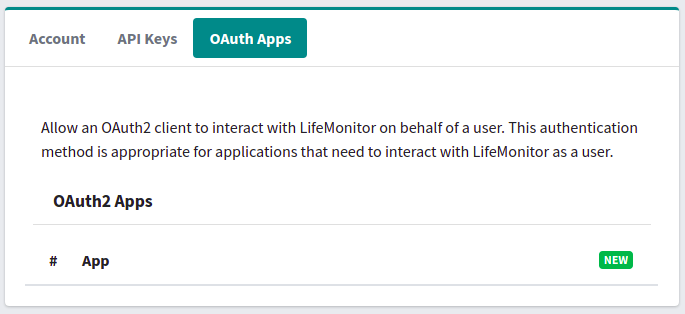

# Authenticating clients with the Life Monitor API

This documentation concerns [Generic Clients](lm_api_specs#clients) (*not*
Registry Clients).

## API key

Once you have logged in to the [Life Monitor web
application](https://api.lifemonitor.eu) you can create an API key for your
client.  Click on the "New" button in the "**API Keys**" section of the page.

The new API key appears in the list and is immediately ready to use.  Copy and
and configure your client to use it.  The API calls compatible with API Key
authentication are specified in the [API
specs](https://api.lifemonitor.eu/static/apidocs.html).

## OAuth2

Life Monitor supports OAuth2 Authorization Code authentication.  All API calls
compatible with this authentication scheme are visible in the [API specs](https://api.lifemonitor.eu/static/apidocs.html) with the authentication scheme *OAuth (AuthorizationCodeFlow)*.

To use OAuth2 with Life Monitor, you have to register your client with Life
Monitor.

### Registering your OAuth2 client

Log in to the web application at <https://api.lifemonitor.eu>.

Select the **OAuth Apps** list.

Client the **New** button on the right.  The OAuth2 Application Client module
opens.

The configuration of this module is actually specific to the client application
you're using.  For a specific example you can look at the instructions on how to
set up the [restish command line client](restish-cli).
