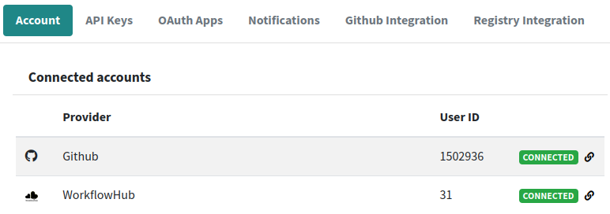

# FAQ

## Which external accounts are connected with my LifeMonitor account?

1. Go to your [profile page](https://api.lifemonitor.eu/profile) on the LifeMonitor
web application.
2. Click the "Account" tab.

You should see a list of the accounts on external identity providers that are
connected with your LM account.  Click on "**connected**" to disconnect the
account.

If an external account is connected with your LM account, then LifeMonitor will
be able to perform authorized actions on that service with your identity. For
instance, you can authorize LM to register workflows on the
[WorkflowHub](https://workflowhub.eu) on your behalf.

:bulb: You will still have to authorize LM to perform specific actions on the
external service.

## How do I connect my LifeMonitor account with other services?

