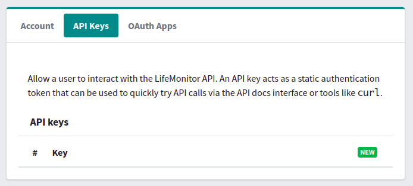

# Getting Started

Follow this guide if you want to use Life Monitor to monitor your workflows.

At the moment, the Life Monitor can be used through its [REST API](lm_api_specs)
or through a command-line client.
Integration with the [Workflow Hub](https://workflowhub.eu/) is in the works, as
well as a web interface and a command line client.

To interact with the API, the first thing to do is to authenticate with the Life
Monitor.

## Create and account and authenticate

Point your browser to the Life Monitor API endpoint <https://api.lifemonitor.eu/>.

:bulb: If you just want to play around or get familiar with the API, use the dev
instance of Life Monitor (replace <https://api.lifemonitor.eu> with
<https://api.dev.lifemonitor.eu> throughout these instructions and examples).

:warning: Please note that the dev instance is meant for testing / development and it
could be wiped out at any time with no warning.

Click on the "**Log in**" button.

You can log in directly with an existing account from one of the supported
external identity providers, like GitHub or the Workflow Hub (use the
appropriate buttons for this).

Alternatively you can click on "Sign Up" and follow the registration procedure
to create an LM-specific account.

## Create an API key

Once you have authenticated, you can create an API key.  Click on the "New"
button in the "**API Keys**" section of the page.

The new API key appears in the list and is immediately ready to use.

## Start Life Monitoring

With your new API key you can directly interact with the [REST
API](lm_api_specs) or use a [command line client](restish-cli).

### API examples

Remember that the API specifications contain examples and you can use your API key to try them out.  Head over to <https://api.lifemonitor.eu/static/apidocs.htm>.
