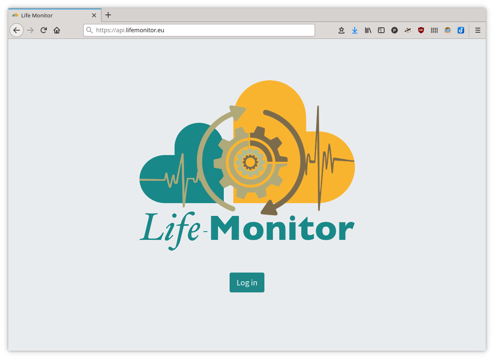

# Getting Started

There are several ways you can interact with LifeMonitor:

* through the [Web Application](https://app.lifemonitor.eu/);
* by using a [command line client](restish-cli);
* programmatically via its [REST API](lm_api_specs);

Under the hood, all of the above access the service via the API. Most API
calls require authentication, so the first thing to do is create an account.

## Create an account and authenticate

Point your browser to the LifeMonitor API endpoint <https://api.lifemonitor.eu/>.

:bulb: If you just want to play around or get familiar with the API, use the dev
instance of LifeMonitor (replace <https://api.lifemonitor.eu> with
<https://api.dev.lifemonitor.eu> throughout these instructions and examples).

:warning: Please note that the dev instance is meant for testing / development and
could be wiped out at any time with no warning.

Click on the "**Log in**" button.

You can log in directly with an existing account from one of the supported
external identity providers, like GitHub or WorkflowHub (use the
appropriate buttons for this).

Alternatively you can click on "Sign Up" and follow the registration procedure
to create an LM-specific account.

## Start Life Monitoring

How to interact with LifeMonitor depends on your tech level and what you want
to achieve. The [web GUI](web-app) is the easiest way to
access the service and get an immediate visual feedback on workflow status.
For more advanced, feature-complete and programmatic interaction, you can use
the [REST API](lm_api_specs) -- e.g., with your own custom client or with a
general openAPI [command line client](restish-cli).

You will need to decide how to [authenticate your
client](authenticate-your-client).  Depending on your
client of choice, you may want to create an API key or use full OAuth2
authentication.

### API examples

The API specifications contain examples you can try out using your API key.
Head over to <https://api.lifemonitor.eu/static/apidocs.html>.
