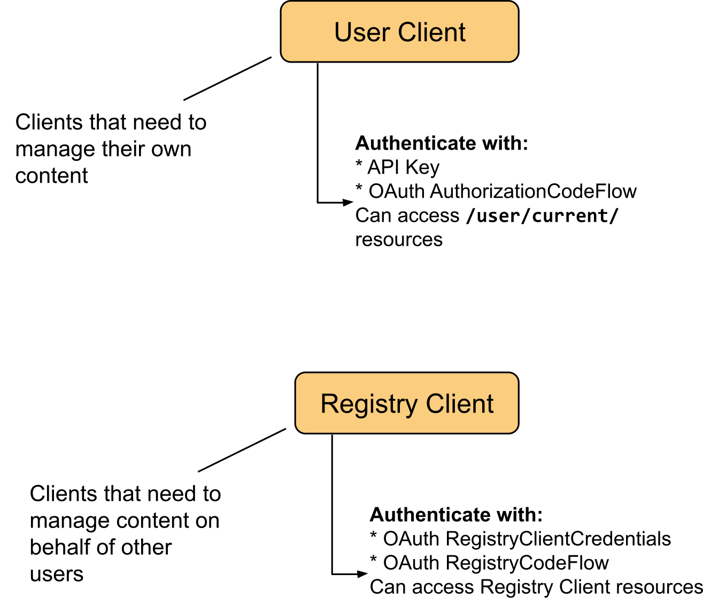

# Life Monitor API Specs

Life Monitor (LM) exposes its functionalities through a RESTful API defined with
[OpenAPI](https://swagger.io/specification).

The LM API is designed with **two types of client** in mind:
1. Users;
2. Registries.

With the API, Users can manage their own workflows and associated workflow
tests.  On the other hand, Registries can *act on their users' behalf*, and thus
can manage workflows and workflow tests that belong to their users. For
instance, you may register a workflow on the [Workflow Hub
registry](https://workflowhub.eu/) and it may in turn register on your behalf
the workflow's tests with the Life Monitor.

The type of client has implications on the authentication method to be used and
on the parts of the API that are relevant.

* **User clients**:
  * must authenticate with API Key or OAuth AuthorizationCodeFlow;
  * can't use Registry Client API resources.
* **Registry clients**:
  * must authenticate with OAuth RegistryClientCredentials or OAuth RegistryCodeFlow;
  * can't use User Client API resources.

Follow [this link to see the API documentation and examples](https://api-lifemonitor-dev.rahtiapp.fi/static/apidocs.html).  You can find the raw YAML API specifications in [the source code repository](https://github.com/crs4/life_monitor/tree/master/specs).  

**Types of API clients**

