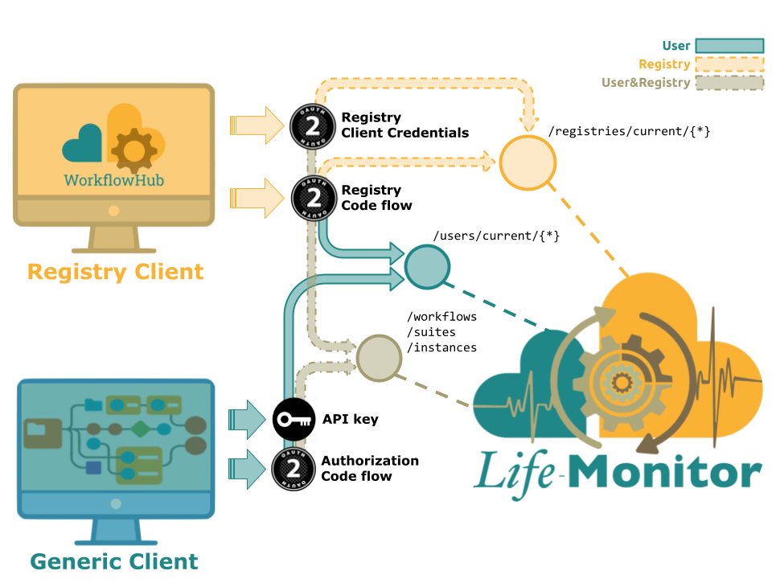

# Life Monitor API Specs

**Life Monitor (LM)** exposes its functionalities through a RESTful API defined with
[OpenAPI](https://swagger.io/specification).

Full specifications are available here: [apidocs.html](https://api-lifemonitor-dev.rahtiapp.fi/static/apidocs.html)

## Clients

The LM API is designed with _two types_ of **clients** in mind:

1. **Generic Client**: can manage a user's workflows and associated workflow tests;

2. **Registry Client**: can act on their users’ behalf and manage their users'
   workflows and associated workflow tests. For instance, you may register a
   workflow on the [Workflow Hub registry](https://workflowhub.eu/) and it (as a
   Registry Client) may in turn register on your behalf the workflow's tests with
   the Life Monitor.

The authorisation mechanisms available for clients are:

* **API key**, can be used to implement generic clients;
* **OAuth2 Client Credentials**, only available for trusted workflow registries
  (see *RegistryClientCredentials*);
* **OAuth2 Authorization Code**, available for both generic clients (see
  *AuthorizationCodeFlow*) and registry clients (see *RegistryCodeFlow*).

Clients can query API endpoints according to the authorisation mechanism they
adopt.  There are in fact resources which are _"contextual"_ to the actor which
the client is acting on behalf of and the type of "impersonated" actor is
determined by the authorisation grant in use. Examples of contextual resources
are:

- `/users/current/*`, which assume an authenticated _user_ and thus can be
  queried only by clients authorised through an _API key_, an OAuth2
_AuthorizationCodeFlow_ or _RegistryCodeFlow_;

- `/registries/current/*`, which assume an authenticated _registry_ and thus can
  be queried only by clients authorised through an OAuth2
_RegistryClientCredentials_ or _RegistryCodeFlow_.

## Links

- [API documentation and examples](https://api-lifemonitor-dev.rahtiapp.fi/static/apidocs.html).
- [YAML API specifications](https://github.com/crs4/life_monitor/tree/master/specs).
