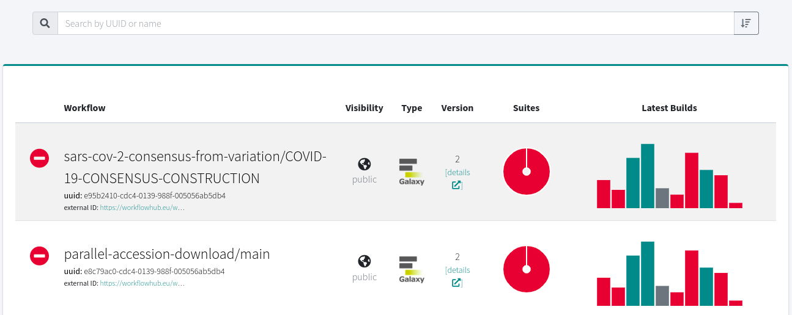
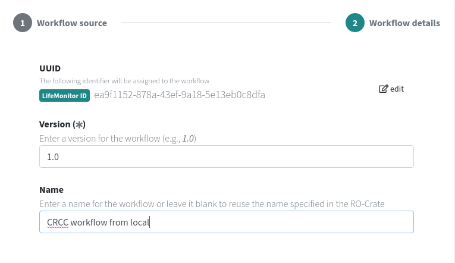

# LifeMonitor Test Monitoring

The LifeMonitor service can be configured to:

* monitor the status of the automated tests you have configured to run on your
  workflow;
* trigger the execution of those tests if too much time has passed since their
  previous execution.



Thus, using LifeMonitor implies that you have created tests for your workflow
and that you have created an automated pipeline to execute them using a
[compatible testing service](#compatible-testing-services).  If you're not
this far yet with your workflow, you can have a look at our [generating
workflow testing tips](./reference_general_workflow_testing_tips).

## Compatible Testing Services

LifeMonitor currently supports monitoring tests that run on [GitHub
Actions](https://docs.github.com/en/actions),
[Jenkins](https://www.jenkins.io/) and [Travis CI](https://www.travis-ci.com/).

## Registering your workflow through the LifeMonitor GitHub app

The [LifeMonitor GitHub
app](./lm_wft_best_practices_github_app#the-lifemonitor-github-app) can
automatically register your workflow testing pipeline with the LifeMonitor
service.

If you use a repository structure that follows best practices it should be able
to automatically extract all the necessary metadata. If you want to use a custom
repository structure then you'll need to provide the app with the metadata
required to create a [Workflow Testing RO-Crate](./workflow_testing_ro_crate).
It may be possible to do this by answering the bot's questions through GitHub
issues; alternatively, you can [manually register your
workflow](#manually-registering-your-workflow).

## Manually registering your workflow

If required, you can manually register your workflow's test pipeline(s) with
the LifeMonitor service (e.g., if your workflow repository is not on GitHub,
or you need to support a custom repository layout).

### Key Concepts

Manually registering your workflow testing pipeline requires creating a
[Workflow Testing
RO-Crate](https://www.lifemonitor.eu/workflow_testing_ro_crate) (WTROC) file
that captures the required metadata (e.g., where do the tests run?). The WTROC
is a specialization of a [Workflow
RO-Crate](https://about.workflowhub.eu/Workflow-RO-Crate/).  You can find an
in-depth description on its [dedicated
page](https://www.lifemonitor.eu/workflow_testing_ro_crate).

Not all entities defined by the WTROC profile are required, though the more
metadata you include the better you will be able to use LifeMonitor's
functionality (i.e., some things can't work if you don't provide the required
metadata).  LifeMonitor requires the definition of at least the following
entities:

* Main workflow: the workflow which is being tested.
* Test suite: a set of tests for the workflow.
* Test service: a software service on which the testing pipeline runs (e.g.,
  GitHub Actions, your institutional Jenkins installation, etc.).
* Test instance: a specific testing pipeline which runs a test suite on a
  specific test service -- i.e., an instantiation of a test suite.

```mermaid
erDiagram
  Workflow ||--o{ TestSuite
  TestSuite ||--o{ TestInstance : has a
  TestInstance --|| TestService : runs on
```

### Instructions

* Create a [Workflow Testing
  RO-crate](https://www.lifemonitor.eu/workflow_testing_ro_crate). Various
  tools can support you in this. We have a [short
  tutorial](./making_a_wtroc_with_ro-crate-py) on how to do this with
  [ro-crate-py](https://github.com/ResearchObject/ro-crate-py#command-line-interface).
* Your RO-Crate must define a test instance pointing to the build service you
  configured (which, in turn, requires you specify the test service).

At this point, you have to submit your RO-Crate to LifeMonitor.

Navigate to the [LifeMonitor dashboard](https://app.lifemonitor.eu/dashboard)
and **make sure you are signed in**. If you're not signed in, click the "Sign
In" button on the top left and follow the instructions; more details on creating
an account and signing in are available [on the dedicated
page](./create_an_account).

Once you're signed in, click on the "+ add" button just above the workflow list
(see image below).


At this point you have a few **options**:

1. Directly upload the Workflow Testing RO-Crate you created.
2. Upload the WTROC somewhere (e.g., your workflow repository) and provide
   LifeMonitor with a URL through which it can download it.
3. First register your workflow with WorkflowHub or WorkflowHub-dev, using the
   WTROC you created.  You'll then be able to select the workflow from a
   drop-down list.  In most cases this is the best option as it allows
   LifeMonitor to update the WorkflowHub entry when it detects new workflow
   releases.

:warning: If registering your workflow from the WorkflowHub registry, you
should authenticate with both LifeMonitor and WorkflowHub with the same
identity (e.g., use your GitHub or WorkflowHub identity).


The wizard process is explained in more detail in the following subsections.

#### Registration via direct WTROC upload

By selecting the "Local RO-Crate Archive" option you'll be able to specify your
local RO-Crate file to upload.  You must upload the full **zip RO-Crate
archive**, not just the `json` metadata file. Click on "Browse" to select the
zip file from your local file system, then click on "Next":

<div align="center">
  
</div>

At this stage, you can specify a version and a name for the workflow; if you
don't specify these, the version will default to 1.0 and the name will be
retrieved from the RO-Crate metadata. Finally, click on "Register" to complete
the process.

#### Registration via remote WTROC download

The "Remote RO-Crate Archive" registration option is similar to the local
archive registration, with the only difference being that instead of uploading a
local zip file you'll be specifying a URL from which LifeMonitor can download
the file.

LifeMonitor supports retrieving the archive only via HTTP and HTTPS. If
necessary, under *Advanced Settings* you can specify an authorization header to
be used to access the archive.

#### Registration via workflow registry (i.e., WorkflowHub)

By selecting the "Registry Workflow" option you can register your workflow after
having already registered it with WorkflowHub (or other compatible
registries).

In most cases, this is the best approach as it allows LifeMonitor to connect its workflow
entry to the WorkflowHub record. This lets LifeMonitor query WorkflowHub for metadata
and, should you decide to install the [LifeMonitor GitHub
app](lm_wft_best_practices_github_app) in the future, it allows LifeMonitor to be
configured to update the WorkflowHub entry when it detects new workflow releases
in your repository; if you installed the LifeMonitor GitHub app from the start, on the other hand, it
could also take care of registering your workflow with WorkflowHub).

If your workflow is not registered in WorkflowHub yet, follow [these
instructions](https://about.workflowhub.eu/Registering-an-existing-Workflow-RO-Crate/)
to submit it.

On the LifeMonitor workflow submission form, choose the appropriate WorkflowHub
instance from the "Registry" drop-down menu (i.e., development or production --
note that not all of them might be available depending on the LifeMonitor
instance):

<div align="center">
  
</div>

Then click on "Workflow" to choose a workflow (start typing in the text box to
narrow down the possible choices). Assuming you've logged in to LifeMonitor
via WorkflowHub, you should have access to all your workflows plus any public
workflows. If you've just registered your workflow with WorkflowHub and cannot
find it in the list, try logging out of LifeMonitor and then logging in again.

<div align="center">
  
</div>

You can choose any workflow, but LifeMonitor won't have anything interesting to
show if it's not coming from a Workflow Testing RO-Crate. Assuming you've
already registered your WTROC, pick that workflow from the list. Similarly to
other registration types, you will now have the option to choose a name for the
workflow. When you're done, click on "Register" to finish. If all went well, the
new workflow should show up on [your dashboard](https://app.lifemonitor.eu/dashboard).


## Changing the visibility of your workflow

By default, after registering a workflow, its visibility will be private,
i.e., only the submitting user will be able to see it. To make it publicly
visible, click on the "edit" icon at the top right of the workflows table,
then click on the "change" button that appears in the "Visibility" column: you
will be asked to confirm your choice, then the workflow will become public.

## Notifications

LifeMonitor can notify you -- within the application or, optionally, via email
-- each time a test instance changes state, i.e., from passing to failing or the
other way around.

To access notifications within the application, click on the bell-shaped icon in
the top-right corner (note that it appears only when there are new notifications
to show):

<div align="center">
  
</div>

By clicking on an event from the list, you will be taken to the corresponding
instance in the dashboard. The panel also allows you to clear selected or all
notifications.

### Enabling e-mail notifications

Point your browser to the [notifications
tab](https://api.lifemonitor.eu/profile?currentView=notificationsTab) of the
LifeMonitor settings.  Enable e-mail notifications by setting the switch to on
and configure your email address in the form.  You will have to confirm the
validity of the e-mail address by clicking on a validation link that will be
sent to your e-mail inbox.


## Next steps

Check the description of the [LifeMonitor dashboard](./lm_dashboard).
