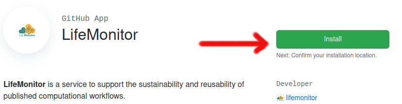
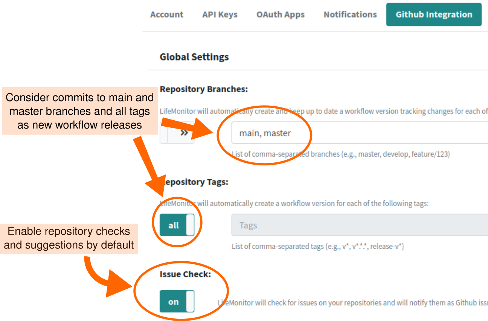

# The LifeMonitor GitHub app

LifeMonitor supports the application of workflow sustainability
**best practices**.  Much of this revolves around following *community-accepted
conventions* for your specific workflow type and implementing *periodic workflow
testing*. Following conventions allows existing computational tools to understand
your workflow and its metadata. On the other hand, periodic workflow testing
ensures that problems that can arise over time due to software collapse are
detected and interested people notified: for workflow authors, it gives them the
opportunity to fix the workflow and keep it useful; for potential workflow
re-users, it reassures them that the workflow works and is maintained.

LifeMonitor mainly supports the application of repository best practices through
its [GitHub app](#the-lifemonitor-github-app), while the LifeMonitor *service*
[supports periodic workflow testing](./lm_test_monitoring).

## Supported repositories

To use the GitHub app, your workflow must be hosted in a GitHub
repository; on the other hand, the test monitoring functionality can be used
with any [compatible testing
service](./lm_test_monitoring#compatible-testing-services) accessible from
the LifeMonitor server. Supported best-practice repository layouts include:

* [IWC](https://github.com/galaxyproject/iwc) ([Galaxy](https://galaxyproject.org/))
* [snakemake-workflows](https://github.com/snakemake-workflows/docs) ([Snakemake](https://snakemake.readthedocs.io/en/stable/))
* [nf-core](https://nf-co.re/) ([Nextflow](https://www.nextflow.io/))

## The LifeMonitor GitHub App

The [LifeMonitor GitHub app](https://github.com/apps/lifemonitor) does the
following things.

* Examines the repositories on which it is installed and applies a series of
  *checks*.
* Suggests pull requests to make changes or additions to bring the workflow
  repository closer to conforming to best practices.
* Opens issues to let you know about problems detected by the checks:
  * you can interact with the LifeMonitor bot through the issues, to provide
    information or issue commands.
* Registers new releases/versions of the workflow with both the [LifeMonitor
  service](https://app.lifemonitor.eu/) and the
  [WorkflowHub](https://workflowhub.eu/) workflow registry.

The default settings for these actions can enabled or disabled through the app
configuration (see below).

Exactly which checks are applied depends on the type of workflow you have and
can change in time as the development of LifeMonitor moves forward.

### Installation

1. Navigate to the [LifeMonitor GitHub app management
   page](https://github.com/apps/lifemonitor).
2. Click the **Install** button;
    
3. **Pick the repository** where you want to install the app.
    * Pick the account or organization that owns the repository;
    * Select one or more repositories using the form, the click **Install &
      authorize**.
4. If it's the first time you install the app, the process will take you to the
   LifeMonitor web site to **configure the GitHub integration settings** (see image
   below).
    * To fully enable the GitHub app, make sure "Issue Checks" are enabled.
    * Set the default branches and tags that the app should consider as "new
      releases".
    * All the global settings can be overridden in the [repository-specific
      configuration file](#configuration-file).
    * **Recommended settings**:


5. [Optional] Enable **automatic upload to the [WorkflowHub](https://workflowhub.eu/)**
   registry.
     * Turn on registry integration in the [configuration page](https://api.lifemonitor.eu/profile?currentView=registrySettingsTab)
     * The LM app will then upload your new workflow releases automatically.
     * The settings from step 4 will be used to identify new releases.


### Configuration File

In addition to the [global GitHub integration
settings](https://api.lifemonitor.eu/profile?currentView=githubSettingsTab), the
LifeMonitor GitHub app looks for a configuration file called `lifemonitor.yaml`
at the base of the repository.  In that file you can customize the behaviour of
the bot for the specific repository; settings in the file override
the global settings in the LifeMonitor web app.

You can see a full example configuration file here: [`lifemonitor.yaml`](./lifemonitor.yaml).

#### Configuration keys

Base configuration settings:

| Property | Description | Type | Default |
|----------|-------------|------|---------|
| name: | Name of the workflow to be shown in LifeMonitor | string | Name in RO-Crate; repository name |
| public: | Workflow visibility. Public workflows and their tests status can be seen by everyone on the LifeMonitor web site | boolean | ? |
| issues.check: | Enable repository checks | boolean | set in global settings |
| issues.include: | Validations to activate | array of strings | all validations |
| issues.exclude: | Validations to deactivate | array of strings | empty |

Branches and tags to be monitored for new workflow
versions are specified through the `push.branches` and `push.tags` properties.
Each of these takes an array of objects with the following properties.

* `name`: Glob pattern matching a branch or tag name.
* `update_registries`: Array of names of registries to update when a new
    workflow version is available. Recognized registries are listed at the
    endpoint <https://api.lifemonitor.eu/registries>.
* `enable_notifications`:  
* `lifemonitor_instance`: Which LifeMonitor instance to notify (default:
  "production"; can be set to "development").

By default, the `main` branch is monitored.

Here is an example:

```yaml
push:
  branches:
    - name: "main"
      update_registries: []
      enable_notifications: true
  tags:
    - name: "v*.*.*"
      update_registries: ["wfhub"]
      enable_notifications: true
```

### Example configuration

Here's an example configuration for a workflow that is:

* publicly visible on LifeMonitor;
* where releases are marked as git tags with names like `v1.0.0`;
* and new releases are registered with both WorkflowHub and LifeMonitor.

```yaml
public: True

issues:
  check: true

push:
  tags:
    - name: "v*.*.*"
      update_registries: [wfhub]
      enable_notifications: true
```

### Checks/validations

You can see the list of validations active in LifeMonitor at
<https://api.lifemonitor.eu/workflows/issues.html>.
