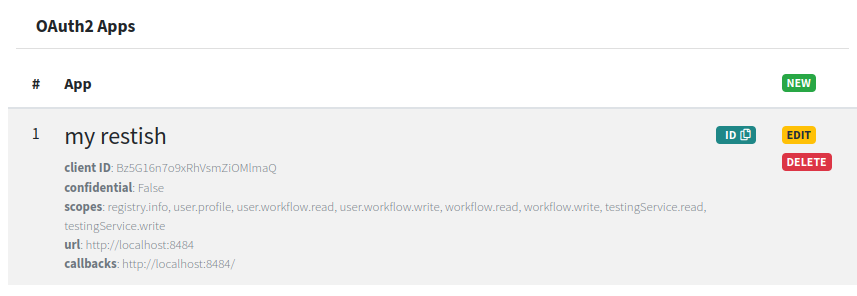

# Life Monitor CLI

You can use Life Monitor from the command line with the
[restish](https://rest.sh/#/guide?id=guide) client for openAPIs.  Follow this
documentation to walk you through the steps to get you going.

## Install restish

Refer to the [restish documentation](https://rest.sh/#/guide?id=installation)
for up-to-date and complete instructions.  For convenience, we summarize the installation steps here.  You have three
options:

Grab a [binary release](https://github.com/danielgtaylor/restish/releases) for
your platform:
```
$ wget https://github.com/danielgtaylor/restish/releases/download/v0.7.0/restish-0.7.0-linux-x86_64.tar.gz
$ tar xzf restish-0.7.0-linux-x86_64.tar.gz
$ ./restish --version
restish version 0.7.0
```

Use `Go get`:
```
$ go get -u github.com/danielgtaylor/restish
```

Use Homebrew:
```
# Add the tap
$ brew tap danielgtaylor/restish

# Install the executable
$ brew install restish
```

## Add Restish as a Life Monitor OAuth2 client

Instructions on how to configure Restish are provided [in its
documentation](https://rest.sh/#/configuration?id=oauth-20-authorization-code).

To add restish as a Life Monitor client, start by logging into the [Life Monitor
web interface](https://api.lifemonitor.eu).

Select the **OAuth Apps** list.  Click on the **New** button on the right of the
list to add a new application.

Assuming you're using Restish from your computer, configure the new client as
follows (make sure you include the trailing slash in the URIs):

* Client name: whatever you like
* Client URI: `http://localhost:8484/`
* Client Redirect URIs: `http://localhost:8484/`
* Allowed scopes: add them all, or be more selective according to your needs
* Client Type: `Off` (i.e., not confidential)

Save the configuration.  You should see the newly configured application in the
OAuth App list.




## Configure Restish to work with the Life Monitor API

Invoke the `restish configure` command with the Life Monitor API URL:
```
$ restish api configure lm https://api.lifemonitor.eu
```

The Restish wizard will guide you through configuration procedure.  Copy values
shown between angle brackets `< >` from the OAuth App you created in Life
Monitor:

```
? Select option Edit profile default
? Select option for profile `default` Setup auth
? API auth type oauth-authorization-code
? Auth parameter client_id <COPY THE "client ID">
? Auth parameter client_secret (optional) 
? Auth parameter authorize_url https://api.lifemonitor.eu/oauth2/authorize
? Auth parameter token_url https://api.lifemonitor.eu/oauth2/token
? Auth parameter scopes (optional) <COPY THE "scopes">
? Add additional auth param? No
? Select option for profile `default` Finished with profile
? Select option Save and exit
```

Now you should be ready to go.  Test things out:  try to query your user
profile:

```
$ restish lm show-current-user-profile
```

Restish should open your browser and direct you to the Life Monitor
application authorization page.

Provide your consent to having Restish access the Life Monitor for you, then the
client should give you a reply:

```
$ restish lm show-current-user-profile
HTTP/1.1 200 OK
Access-Control-Allow-Origin: *
Cache-Control: private
Content-Length: 664
Content-Type: application/json
Date: Mon, 03 May 2021 16:19:52 GMT
Server: nginx
Set-Cookie: session=.eJwlzjkOwjAQQNG7uKbwLLZncpnInkXQJqRC3J1ItP8371P2POJ8lu19XPEo-8vLVlK4YjVYSObQAHhRVeE-OoFOIE4EbLkUxYDvlJ1mj5i-6siaU6J3uj9FdYsp1mkosTAaWfJsyhq6BNQJRRs0dFcO5QoB5YZcZxx_DZfvD0-SLiM.YJAiqA.UZu2x0Zrc7p6LQrgQt-OwTsL8ic; HttpOnly; Path=/
a4f14707e508ff4121052c83aea9e62e=a4c568703bcc20346735ea36d21623e8; path=/; HttpOnly; Secure
Vary: Cookie
X-Frame-Options: SAMEORIGIN

{
  id: 43838
  identities: {
    github: {
      email: ""
      name: "My name"
      picture: "https://avatars.githubusercontent.com/u/1029365?v=4"
      profile: "https://github.com/myname"
      provider: {
        name: "github"
        type: "oauth2_identity_provider"
        uri: "https://api.github.com/"
        userinfo_endpoint: "https://api.github.com/user"
      }
      sub: "5029316"
      username: "myname"
    }
  }
  meta: {
    api_version: "0.2.0-beta2"
    base_url: "https://api.lifemonitor.eu"
    resource: "/users/current"
  }
  username: "myname"
}
```

## What can you do?

The `restish` client will give you access to all API calls.

To see all the available calls:
```
$ restish lm
*Workflow sustainability service*

Life Monitor aims to facilitate the sharing, execution and monitoring of
workflow tests over time, ensuring that deviations from the workflow's
correct operation are detected and communicated to the workflow authors so
that they might be solved, thus extending the useful life of the workflow.

Life Monitor is being developed as part of the [EOSC-Life project](https://www.eosc-life.eu/).

Usage:
  restish lm [flags]
  restish lm [command]

Available Commands:
  get-registry-users                 List users
  instances-builds-get-by-id         Get a test instance build
  instances-builds-get-logs          Get test instance build logs
  instances-delete-by-id             Delete a test instance
  instances-get-builds               Get the latest test instance builds
  instances-get-by-id                Get a test instance
  registry-user-workflows-get        List workflows for a user
  registry-user-workflows-post       Submit workflow for a user
....
```

To see what the commands do, remember that you can refer to the API specs at <https://api.lifemonitor.eu/static/apidocs.html>.

Example:

```
$ restish lm workflows-get -q status=false
HTTP/1.1 200 OK
Access-Control-Allow-Origin: *
Cache-Control: private
Content-Length: 313
Content-Type: application/json
Date: Mon, 10 May 2021 10:27:56 GMT
Server: nginx
Set-Cookie: session=.eJwlzkEOwyAMBdG7sO7C5GNjcpkIY6N2mzSrqncvUg8wevNJxzzjeqb9fd7xSMfL054G5xgSbJuIh4G9W6YNVVS0eQlVIqYGtpCuA92gAKxPEdQ-4ARbKXG2GaylRRgV8pa55I4pJih1lkVooxYLNG5RsmeHpjVyX3H-byDp-wPeaS8Q.YJkKrA.P2zsIG5OnkaFtghFB4OGWeHEwko; HttpOnly; Path=/
9544ac48d9c55647d010c525a5be4146=ba378a3cbd4a1f5f26a99edeab93fb3e; path=/; HttpOnly; Secure
Vary: Cookie
X-Frame-Options: SAMEORIGIN

{
  items: [
    {
      latest_version: "1"
      name: "sort-and-change-case-travis"
      uuid: "bc435030-6e1e-0139-2dea-005056ab5db4"
    }
  ]
  meta: {
    api_version: "0.2.0-beta2"
    base_url: "https://api-lifemonitor-test.rahtiapp.fi"
    resource: "/workflows?status=false"
  }
}
```
