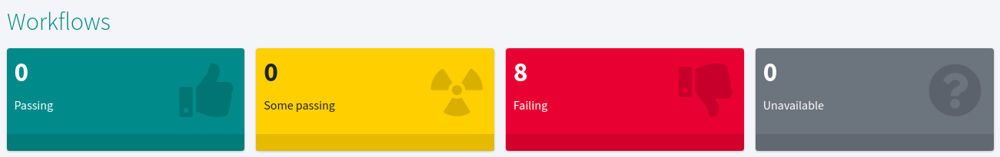
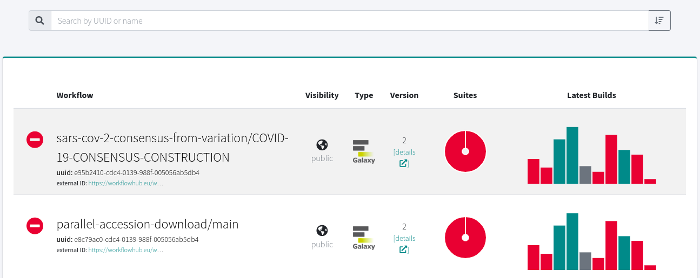
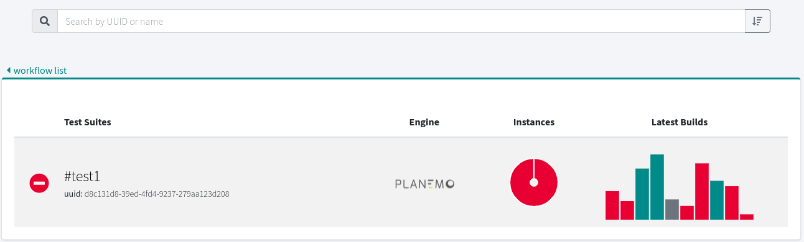
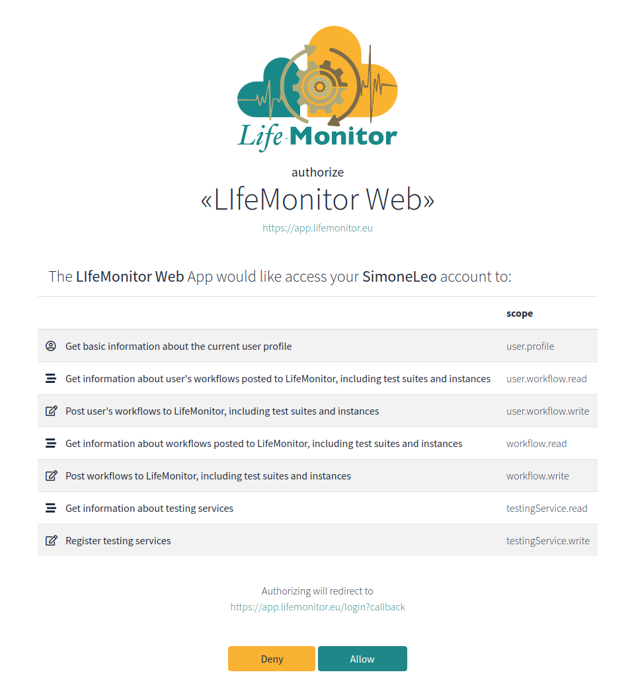
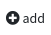
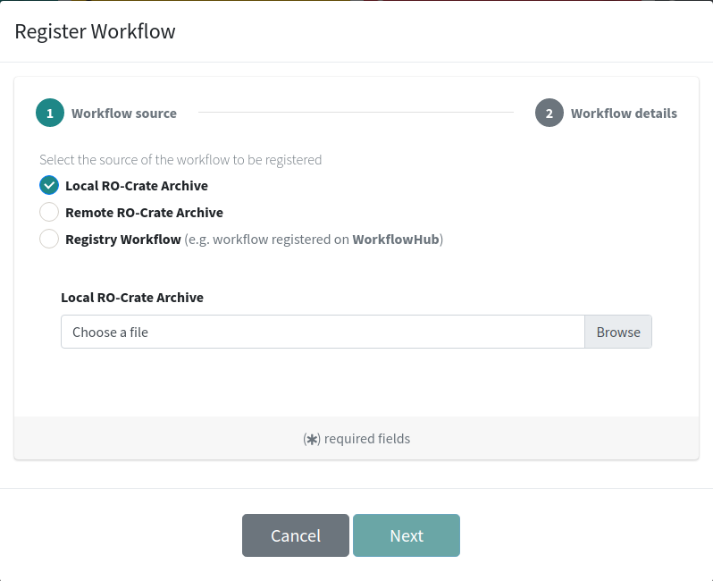
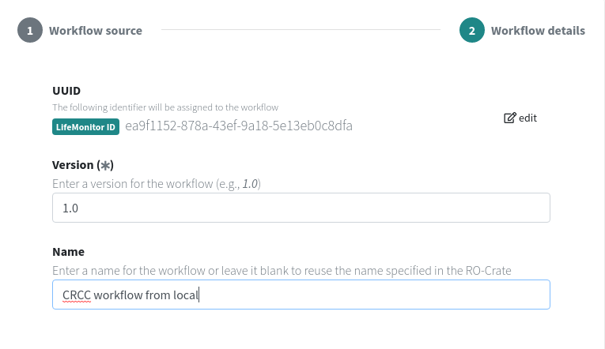
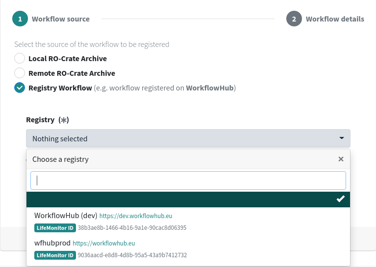
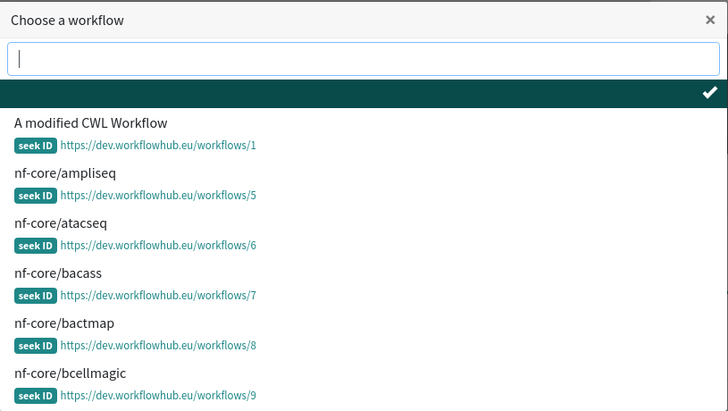

# LifeMonitor Web App

The [LifeMonitor Web App](https://app.lifemonitor.eu) provides a graphical
interface to the service, allowing to get a quick overview of the status of
monitored workflows.

The web app's landing page displays the status of public workflows. At the
top, an overall summary bar shows the number of workflows for each category:

* **Passing:** workflows whose test suites are all successful
* **Some passing:** workflows for which only part of the test suites are passing
* **Failing:** workflows whose test suites are all unsuccessful
* **Unavailable:** workflows with no testing data available

<div class="mb-5" align="center">

</div>

The rest of the page is devoted to a table that reports the detailed status of
each workflow:

<div class="mb-4" align="center">

</div>

Each row contains, from left to right:

* The workflow's name, unique ID and external (registry) ID
* The workflow's visibility (public or private)
* The workflow's type (e.g., Galaxy, CWL)
* The workflow's version
* A pie chart representing the share of passing and failing test suites
* A bar chart showing the duration and outcome of each individual test build

A click on either the workflow's name/UUID or the pie chart leads to a similar
table, this time containing detailed information on each test _suite_ belonging
to the workflow:

<div class="mb-4" align="center">

</div>

Each row shows the following:

* The suite's name and unique ID
* The test engine used by the suite's test definition, if it has one
* A pie chart representing the share of passing and failing test instances
* A bar chart showing the duration and outcome of each build for the suite

Again, clicking on the suite's name/UUID or on the pie chart brings us to the
next level of detail, that of test instances, which is structured in a similar
way to the ones above. Finally, clicking on the instance's name leads to the
instance's main page on the CI service, while clicking on the build bars takes
to each individual build's page.


## Authenticated users

The previous section dealt with browsing through public workflows. To see your
private workflows, log in by clicking on "Sign in" at the top right of the
landing page. Assuming you've already [logged in to
LifeMonitor](getting_started#create-an-account-and-authenticate), you will
receive an authorization request from the Web application:

<div align="center">
  
</div>

Click on "Allow" at the bottom; you will be taken back to the dashboard, but
this time you should be able to see all workflows that you submitted. By
default, public workflows are not shown here: you can opt to display selected
ones by _subscribing_ to them. To do that, start typing the name in the Search
box, choose a workflow and click on the "subscribe" button:

<div align="center">
  
</div>


## Submitting a workflow

### Making a Workflow Testing RO-Crate

In order to have your workflow monitored by LifeMonitor, you need to package
it as a [Workflow Testing RO-Crate](workflow_testing_ro_crate): you can do
that with the [ro-crate-py](https://github.com/ResearchObject/ro-crate-py)
Python package. Set up a Python virtual environment and install ro-crate-py:

```
python3 -m venv venv
source venv/bin/activate
pip install --upgrade pip
pip install rocrate
```

Now move into the directory that contains your workflow and associated
assets. This can be, for instance, a copy of a repository in a version control
provider such as [GitHub](https://github.com/). As an example, we're going to
use the [FAIR CRCC - send data](https://github.com/crs4/fair-crcc-send-data)
workflow.

```
git clone https://github.com/crs4/fair-crcc-send-data
cd fair-crcc-send-data/
```

Remove the Git and GitHub auxiliary directories and initialize the crate:

```
rm -rf .git .github
rocrate init
```

The above command creates an `ro-crate-metadata.json` file at the top level
that simply lists all files as `"File"` and directories as `"Dataset"`. This
includes the main workflow file:

```json
{
    "@id": "workflow/Snakefile",
    "@type": "File"
}
```

To register it as a computational workflow, run the following command:

```
rocrate add workflow -l snakemake workflow/Snakefile
```

If you check the JSON file now, you'll see that the entry for
`workflow/Snakefile` is more articulate: for instance, it has a more specific
`@type` and it links to an entity representing the Snakemake language. Other
changes have also been made to the crate so that it conforms to the [Workflow
RO-Crate spec](https://about.workflowhub.eu/Workflow-RO-Crate/). If your
workflow is written in a different language, specify it using the `-l` option
as shown above. To get a list of supported options, run:

```
rocrate add workflow --help
```

Now we need to point the crate to a test instance for the
workflow. LifeMonitor supports monitoring test executions that run on [Travis
CI](https://travis-ci.org/), [Jenkins](https://www.jenkins.io/) and [GitHub
Actions](https://docs.github.com/en/actions). In this case, the (scientific)
workflow is tested by a GitHub Actions workflow defined by
[.github/workflows/main.yml](https://github.com/crs4/fair-crcc-send-data/blob/main/.github/workflows/main.yml)
(note that the fact that we removed the `.github` directory from our local
copy of the repository is not a problem, since we'll have to refer to the CI
workflow via a remote URL).

First, create a test suite:

```
rocrate add test-suite -i \#test1
```

Then, add a test instance that points to the CI workflow:

```
rocrate add test-instance \#test1 https://api.github.com -s github \
  -r repos/crs4/fair-crcc-send-data/actions/workflows/main.yml \
  -i \#test1_1
```

Where `https://api.github.com` is the service URL, while the argument of the
`-r` option is a reference to the CI workflow in the form:

```
repos/<OWNER>/<REPO NAME>/actions/workflows/<YAML FILE NAME>
```

That's it! If you want, you can check `ro-crate-metadata.json` again to see
how it changed in response to the above commands. All that's left to do is to
zip the crate in the format accepted by WorkflowHub:

```
rocrate write-zip /tmp/fair-crcc-send-data.crate.zip
```

### Registering your workflow

As an [authenticated user](#authenticated-users), click on "add" at the top
right of the workflows table:

<div align="center">
  
</div>

The following interface appears:

<div align="center">
  
</div>

The default option is to submit a local Workflow Testing RO-Crate (see the
[above instructions](#making-a-workflow-testing-ro-crate) to create one). Click
on "Browse" to select the zip file from your local file system, then click on
"Next":

<div align="center">
  
</div>

You can specify a version and a name for the workflow; if you don't, the
version will default to 1.0 and the name will be retrieved from the RO-Crate
metadata. Finally, click on "Register" to complete the process.

The "Remote RO-Crate Archive" registration option is similar to the above, but
in this case you need to specify a URL for the RO-Crate zip, rather than
choose a file from your local file system.

The third option is to register with LifeMonitor a workflow that's already
been registered to WorkflowHub. If your workflow is not in WorkflowHub yet,
follow [these
instructions](https://about.workflowhub.eu/Registering-an-existing-Workflow-RO-Crate/)
to submit it. On the LifeMonitor workflow submission system, choose the
"Registry Workflow" option, then click on the "Registry" drop-down menu and
choose a WorkflowHub instance (development or production -- note that not all
of them might be available depending on the LifeMonitor instance):

<div align="center">
  
</div>

Then click on "Workflow" to choose a workflow (start typing in the text box to
narrow down the possible choices). Assuming you've logged in to LifeMonitor
via WorkflowHub, you should have access to all your workflows plus any public
workflows. If you've just registered your workflow with WorkflowHub and cannot
find it in the list, try logging out of LifeMonitor and then logging in again.

<div align="center">
  
</div>

You can choose any workflow, but LifeMonitor won't have anything interesting
to show if it's not coming from a Workflow Testing RO-Crate. Assuming you've
already registered the crate we [created
above](#making-a-workflow-testing-ro-crate), pick that workflow from the
list. Similarly to other registration types, you will now have the option to
choose a name for the workflow. When you're done, click on "Register" to
finish. If all went well, the new workflow should show up on your dashboard.

### Changing the visibility of your workflow

By default, after registering a workflow, its visibility will be private,
i.e., only the submitting user will be able to see it. To make it publicly
visible, click on the "edit" icon at the top right of the workflows table,
then click on the "change" button that appears in the "Visibility" column: you
will be asked to confirm your choice, then the workflow will become public.
