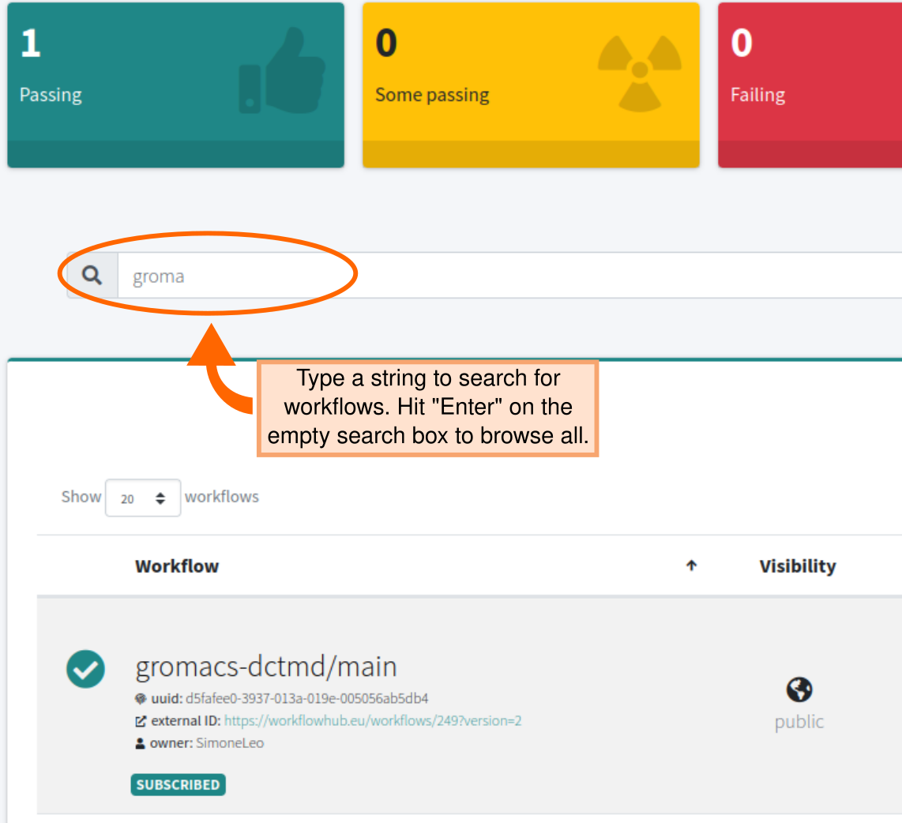
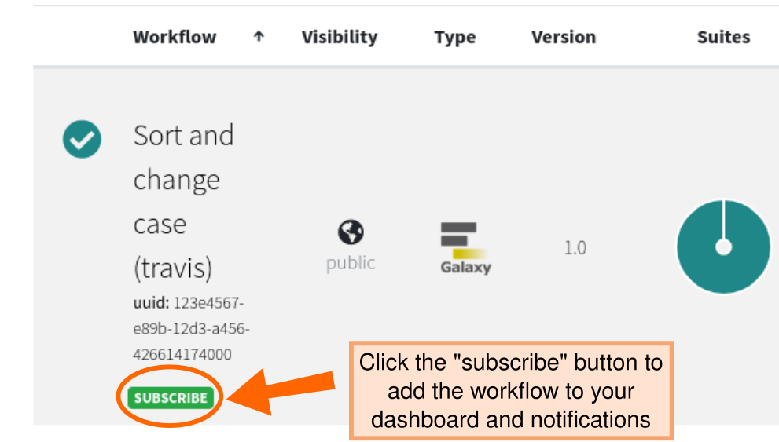

# LifeMonitor Dashboard

The [LifeMonitor Web App](https://app.lifemonitor.eu) provides a graphical
interface to the service, allowing to get a quick overview of the status of
monitored workflows.

To do anything but see public workflows on the dashboard you must authenticate
(i.e., "sign in") with the LifeMonitor service by clicking on "Sign in" at the
top right of the landing page.  See the [dedicated page](./create_an_account)
for more details.

## LM Dashboard

The dashboard page is the main landing page when you access the LifeMonitor. The
dashboard includes:

1. your workflows;
2. the workflows to which you have [*subscribed*](#subscribing-to-workflows).

### Adding workflows

Naturally, the first way in which to add workflows to the dashboard is to
register your own workflows, either through the [LM GitHub
app](./lm_wft_best_practices_github_app) or
[manually](./lm_test_monitoring#manually-registering-your-workflow).

But, you can also add workflows by searching for them in LifeMonitor and
subscribing to their test notifications.

#### Searching for workflows

Enter a string in the search box at the top of the dashboard and LifeMonitor
will list the workflows with names that contain the string you entered.  Press
"Enter" on an empty search box to browse the registered workflows to which you
have access.

#### Subscribing to workflows

You can subscribe to other people's public workflows.  If you do, those workflows
will appear on your dashboard and you will be notified when their test status
changes (e.g., when they are fixed after a period of test failures).

To subscribe, search for the workflow and click on its "Subscribe" button.

  

### Summary table

At the top of the dashboard, an overall summary bar shows the number of
workflows for each category of testing outcomes.  You can click on a category to
filter the workflow list.

| Category         | Definition                               |
| ---              | ---                                      |
| **Passing**      | all test suites were successful          |
| **Some passing** | only part of the test suites are passing |
| **Failing**      | test suites are all unsuccessful         |
| **Unavailable**  | no testing data available                |

### Workflow list

The main part of the dashboard is the list monitored workflows reporting their
detailed test statuses:

Each row begins with workflow metadata. From left to right:

* The workflow's **name**, **unique ID** and external (registry) ID
  * Name is configured during the registration process (e.g., extracted from
    RO-Crate, or inserted manually);
  * The unique ID is generated by LM;
  * The external ID is available if the workflow's record is matched to a record
    in the WorkflowHub registry (e.g., because it was imported from it).
  * If available, additional metadata is also shown here, like workflow author,
    submitter, etc.
* The workflow's **visibility** (public or private)
  * only you can see private test results; anyone can see public test results.
* The **workflow type** (e.g., Galaxy, CWL)
* The **workflow version**

The *Suites* and *Latest Builds* columns report test results.

**Suites**: a pie chart showing the share of passing and failing test suites.

**Latest Builds**: A bar chart showing the duration and outcome of each
individual test run.

* Green for passed; red for failed.
* The height of the bar is proportional to the time the pipeline took to
  execute.
* The 10 latest builds are shown.

From the Workflow List, a click on either the workflow's name/UUID or the pie
chart you can dig down into more detailed reports about the status of TestSuites
and the TestInstances where they are executed (see [Key
Concepts](./lm_test_monitoring#key-concepts).
